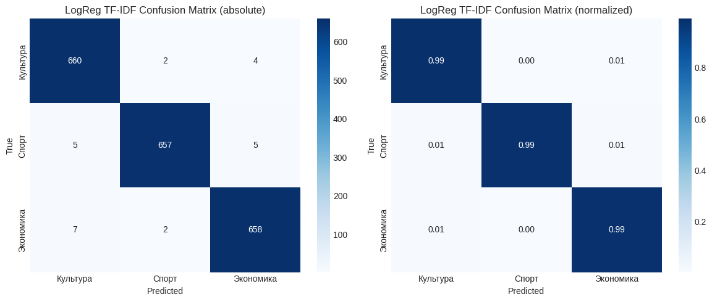
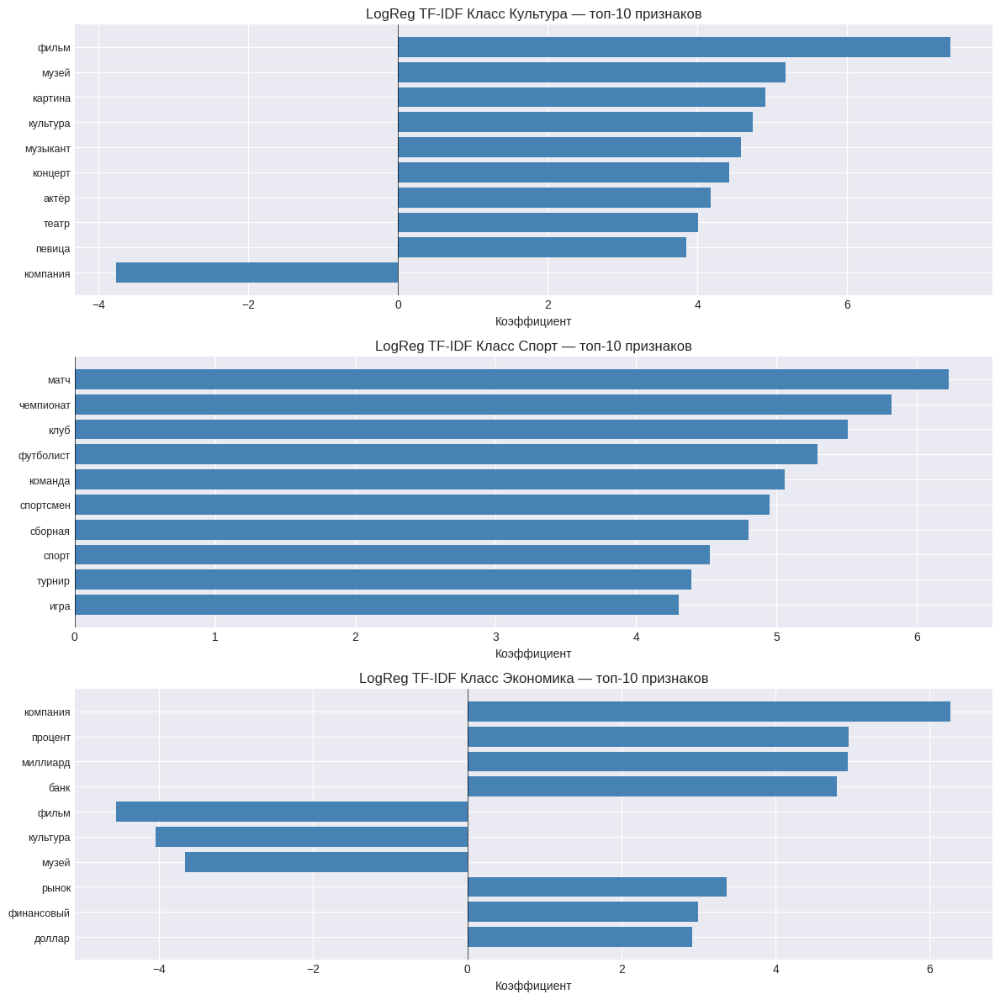
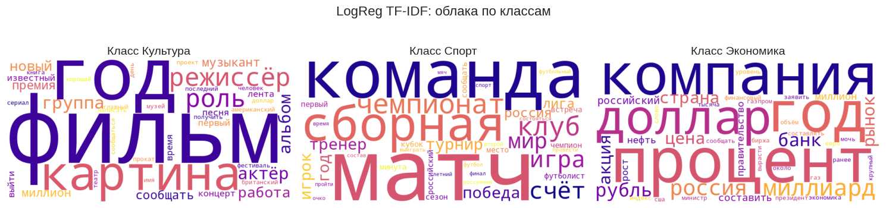

# Text Classification of Russian News (Culture, Sports, Economics)  
# Классификация русскоязычных новостей (Культура, Спорт, Экономика)

[](https://opensource.org/licenses/MIT)


---

## 🇬🇧 English

### Project Description
This project focuses on classifying Russian news texts into three topics: **Culture, Sports, and Economics**.  
We compared **7 machine learning and deep learning models**, performed comprehensive data preprocessing, hyperparameter tuning, and visual analysis.

**Key steps:**
- Text cleaning and lemmatization (removal of numbers, stop words, Latin characters; preservation of abbreviations and short meaningful words).
- Class balancing (3333 texts per class, total ~10k).
- Training and tuning of 7 models:
  - Classical: LogisticRegression, SVM, RandomForest, MultinomialNB, KNN.
  - Deep learning:  ruBERT-tiny + LR, SentenceTransformers + LR.
- Detailed analysis: confusion matrices, per‑class precision/recall, ROC curves, feature importance, learning curves, PCA/t‑SNE, word clouds.
- Final comparison and selection of the best model.

### Results

| Model | Test F1 (macro) | Training time (min) |
|-------|-----------------|---------------------|
| **LogisticRegression + TF-IDF (optimized)** | **0.9875** | 0.77 |
| SVM + TF-IDF (lightning) | 0.9860 | 1.56 |
| MultinomialNB + TF-IDF | 0.9840 | 2.97 |
| RandomForest + TF-IDF | 0.9835 | 2.90 |
| SentenceTransformers + LR | 0.9820 | 31.62 |
| KNN + TF-IDF (optimized) | 0.9800 | 1.70 |
| ruBERT-tiny + LR | 0.9595 | 2.72 |

**Best model:** LogisticRegression + TF-IDF (C=10, max_features=7000) with F1‑macro = **0.9875** and training time under 30 seconds.

Visualization Examples / Примеры визуализаций

### Confusion Matrix (LogisticRegression) / Матрица ошибок (логистическая регрессия)


### Feature Importance (LogisticRegression) / Важность признаков (логистическая регрессия)


### PCA and t‑SNE (LogisticRegression) / PCA и t‑SNE (логистическая регрессия)


### Learning curve (LogisticRegression) / Кривая обучения (логистическая регрессия)


### Word Clouds / Облака слов



### Learning Time of all models / Время обучения всех моделей


### Model Comparison / Сравнение всех моделей


### Technologies Used
- **Python** (3.8+)
- **scikit-learn** – models, metrics, GridSearch/RandomizedSearch
- **NLTK** – stop words
- **Transformers**, **SentenceTransformers** – embeddings
- **Matplotlib**, **Seaborn**, **WordCloud** – visualization
- **Pandas**, **NumPy** – data manipulation
- **Joblib** – model persistence

### Dataset
The dataset `df_lemmatized.csv` is **not included** in this repository due to its size ( > 100 MB).  
You can download it from Google Drive: [Download dataset](https://drive.google.com/file/d/1OaZAMZzWQTkkpVTk3JlHbfLLyLNrwhyF/view?usp=sharing)

### How to Run

1. Clone the repository:
   ```bash
   git clone https://github.com/rahimova-zulya/text-classification-project.git
   cd text-classification-project
   ```
2. Install dependencies:
   ```bash
   pip install -r requirements.txt
   ```
3. Launch Jupyter Notebook:
   ```bash
   jupyter notebook Rakhimova_Text_Classifier_7_models.ipynb
   ```

License
This project is licensed under the MIT License – see the LICENSE file for details.

## 🇷🇺 Русский

### Описание проекта
Проект посвящён задаче классификации русскоязычных новостей по трём тематикам: **Культура, Спорт, Экономика**.  
Было проведено сравнение **7 моделей машинного и глубокого обучения**, выполнена полная предобработка данных, подбор гиперпараметров и визуальный анализ.

**Основные этапы:**
- Очистка и лемматизация текстов (удаление чисел, стоп‑слов, латиницы; сохранение аббревиатур и коротких значимых слов).
- Балансировка классов (по 3333 текста на класс, всего ~10k, изначальный датасет - 187 тысяч текстов).
- Обучение и тюнинг 7 моделей:
  - Классические: LogisticRegression, SVM, RandomForest, MultinomialNB, KNN.
  - Глубокие: ruBERT‑tiny + LR, SentenceTransformers + LR.
- Детальный анализ: матрицы ошибок, precision/recall по классам, ROC‑кривые, важность признаков, кривые обучения, PCA/t‑SNE, облака слов.
- Финальное сравнение и выбор лучшей модели.

### Результаты

| Модель | Тестовый F1 (macro) | Время обучения (мин) |
|--------|---------------------|----------------------|
| **LogisticRegression + TF‑IDF (оптимизированная)** | **0.9875** | 0.49 |
| SVM + TF‑IDF (lightning) | 0.9860 | 1.53 |
| MultinomialNB + TF‑IDF | 0.9840 | 3.13 |
| RandomForest + TF‑IDF | 0.9835 | 3.01 |
| SentenceTransformers + LR | 0.9820 | 36.42 |
| KNN + TF‑IDF (оптимизированная) | 0.9800 | 1.67 |
| ruBERT‑tiny + LR | 0.9595 | 3.07 |

**Лучшая модель:** LogisticRegression + TF‑IDF (C=10, max_features=7000) с F1‑macro = **0.9875** и временем обучения менее 30 секунд.

### Используемые технологии
- **Python** (3.8+)
- **scikit‑learn** – модели, метрики, GridSearch/RandomizedSearch
- **NLTK** – стоп‑слова
- **Transformers**, **SentenceTransformers** – эмбеддинги
- **Matplotlib**, **Seaborn**, **WordCloud** – визуализация
- **Pandas**, **NumPy** – обработка данных
- **Joblib** – сохранение моделей

### Датасет
Файл с данными `df_lemmatized.csv` **не включён** в этот репозиторий из-за большого размера ( > 100 МБ).  
Вы можете скачать его с Google Диска: [Скачать датасет](https://drive.google.com/file/d/1OaZAMZzWQTkkpVTk3JlHbfLLyLNrwhyF/view?usp=sharing)

### Запуск проекта

1. Склонируйте репозиторий:
   ```bash
   git clone https://github.com/rahimova-zulya/text-classification-project.git
   cd text-classification-project
   ```
2. Установите зависимости:
   ```bash
   pip install -r requirements.txt
   ```
3. Запустите Jupyter Notebook:
   ```bash
   jupyter notebook Rakhimova_Text_Classifier_7_models.ipynb
   ```
   
Лицензия
Этот проект распространяется под лицензией MIT – подробности в файле LICENSE.
